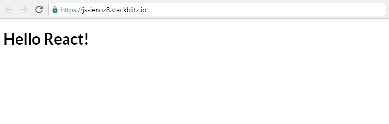

## Todos

1. Go to https://stackblitz.com/ and create a `blank javascript Project`

2. Delete all auto generated code in the index.js

3. Add `react` and `react-dom` dependencies

4. Display `Hello React !` to the screen using the `render` function

## Further help

- https://reactjs.org/docs/react-dom.html#render

## Expected results:

