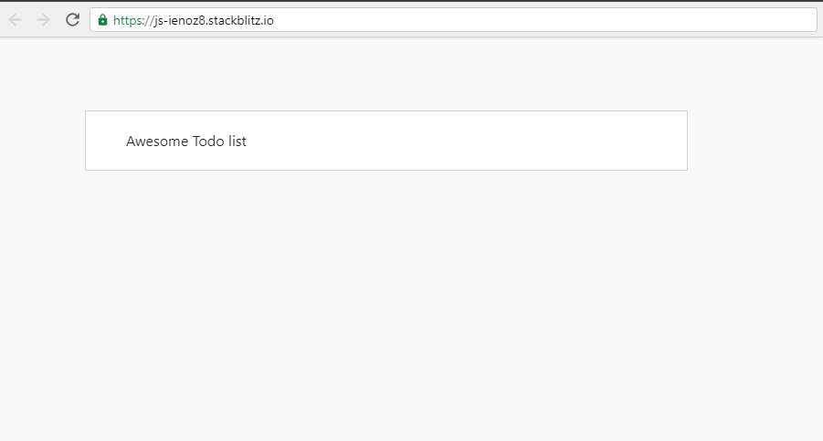

## Todos

1. Replace the content of the index.html file with the provided `index.html`

2. Create a style.css file using the provided `style.css`

3. Create a functional component called `MyApp` using the HTML code snippet below

4. Don't forget to import the styles ;)

5. Display the `Awesome Todo list` using a variable instead of hard coding it in the view

## Further help

- https://reactjs.org/docs/getting-started.html
- https://reactjs.org/docs/components-and-props.html#function-and-class-components

## Expected results:



## Resources:

``` html
<div className="padding">
    <div className="row container d-flex justify-content-center">
        <div className="col-lg-12">
            <div className="card px-3">
                <div className="card-body">
                    <!-- TODO 5: Don't hard code me -->
                    Awesome Todo list
                </div>
            </div>
        </div>
    </div>
</div>
```