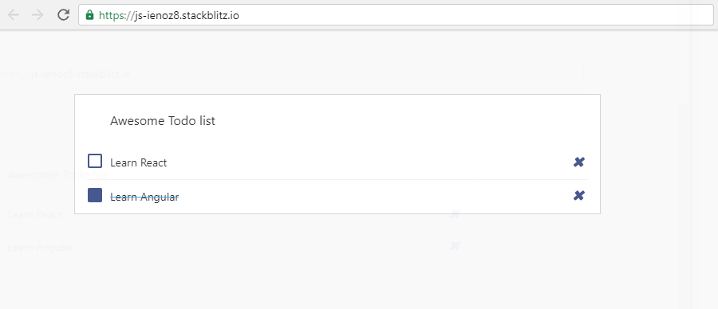

## Todos

1. Move `MyApp` component to its own file and make sure there are no regressions

2. Add a `TodosList` component as a child component to `MyApp` using the HTML code snippet below

3. Make the Learn Angular todo item look done using `completed` css class and don't forget to tick the checkbox

## Expected results:



## Resources:

``` html
<div class="list-wrapper">
    <ul class="d-flex flex-column-reverse todo-list">
    <!-- TODO 3: li element needs your help -->
    <li>
        <div class="form-check">            
        <label class="form-check-label">              
            <input class="checkbox" type="checkbox" /> Learn Angular <i class="input-helper" />
        </label>
        </div>
        <i class="remove mdi mdi-close-circle-outline" />
    </li>

    <li>
        <div class="form-check">            
        <label class="form-check-label">              
            <input class="checkbox" type="checkbox" /> Learn React <i class="input-helper" />
        </label>
        </div>
        <i class="remove mdi mdi-close-circle-outline" />
    </li>
    </ul>
</div>
```