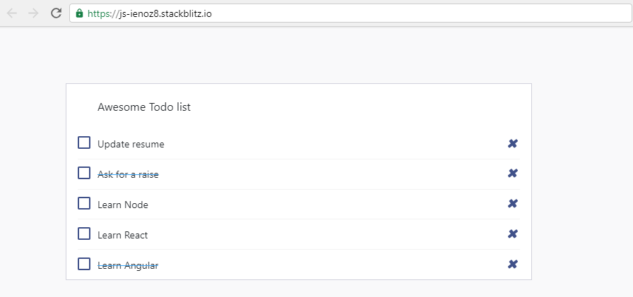

## Todos

1. Refactor `TodosList` to create a `TodoItem` component which encapsulates an item of the list

2. Actually, we have a long list of todos, display as many `TodoItem` components as there are in the snippet below

3. Pass down the title and completed properties to the `TodoItem` component

## Expected results:



## Resources:

``` js
export const data = [
    {
        id: 1,
        title: "Learn Angular",
        completed: true
    },
    {
        id: 2,
        title: "Learn React",
        completed: false
    },
    {
        id: 3,
        title: "Learn Node",
        completed: false
    },
    {
        id: 4,
        title: "Ask for a raise",
        completed: true
    },
    {
        id: 5,
        title: "Update resume",
        completed: false
    }
]
```