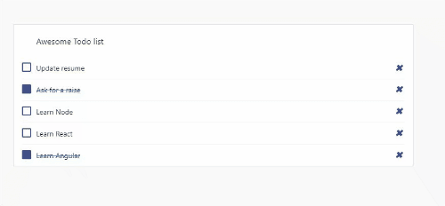

## Todos

1. Convert the `TodosList` component to a class based component

2. In the `TodoItem`, create a change event handler to log to the console when the checkbox is ticked

3. Create an updateItem function on the `TodosList` component to update the status of todo item (a.k.a `completed` property)

4. Replace the change event handler in the `TodoItem` component with the updateItem function

5. Try to do the same steps for the delete icon to remove its corresponding todo item from the list

## Further help

https://reactjs.org/docs/state-and-lifecycle.html#converting-a-function-to-a-class

## Expected results:

