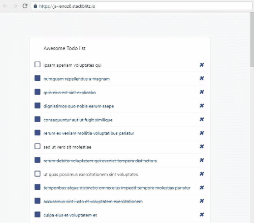

## Todos

1. Using the right lifecycle hook, fetch the todos data from the server `https://jsonplaceholder.typicode.com/todos`

2. Try to add a `Loading ..` message while the data is being fetched

## Further help

https://reactjs.org/docs/state-and-lifecycle.html#adding-lifecycle-methods-to-a-class
http://projects.wojtekmaj.pl/react-lifecycle-methods-diagram/
https://developer.mozilla.org/en-US/docs/Web/API/Fetch_API/Using_Fetch

## Expected results:

