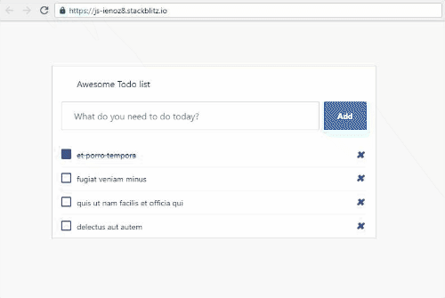

## Todos

1. Add an input box to create new todos using the snippet below. Make sure its on the same level as <div className="list-wrapper"> of TodosList component

2. Create a change handle for the new input to store the title of the new todo item. Don't forget to set the input value to the new title

3. Create a click handler for the Add button to add the new todo to the list (Experiment with arrow functions and destructuring)

4. Don't forget to reset the input box once the new item has been added

## Expected results:



## Resources

```HTML
<div className="add-items d-flex"> <input type="text" className="form-control todo-list-input" placeholder="What do you need to do today?"/> <button className="add btn btn-primary font-weight-bold todo-list-add-btn">Add</button> </div>
```