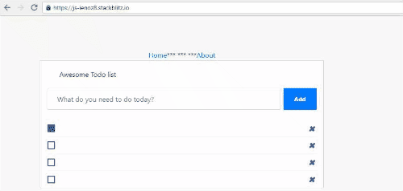

## Todos

1. Add ReactRouter to the project

2. Setup the ReactRouter to have two routes (`/` and `/about`)

3. While the default route is for the `TodosList`, use the provided `About` component when the url is equal to `/about`

## Further help

- https://www.freecodecamp.org/news/react-router-in-5-minutes/

## Expected results:

